# hungry-wormy 

**Last Update: 06/Apricl/2019.**

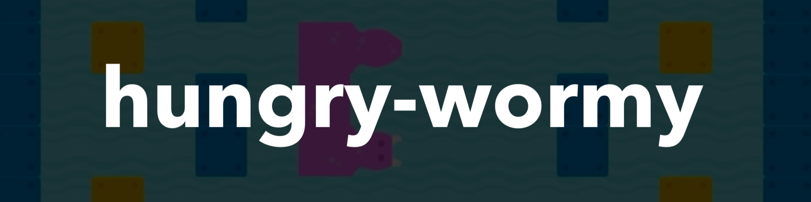

### If you like the project, please give it a star ⭐ It will show the creator your appreciation and help others to discover the repo.

# ✍️ About
🐛 `Hungry Wormy` is a retro game reincarnation implemented on top of SpriteKit framework for `iOS` & `macOS`.

# 📺 Demo
Please wait while the `.gif` files are loading...

  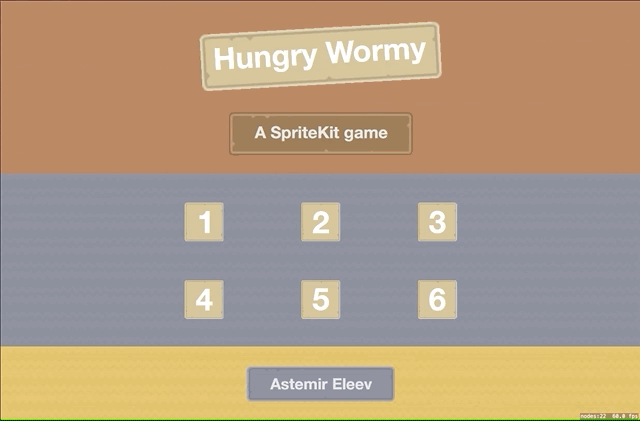

   
  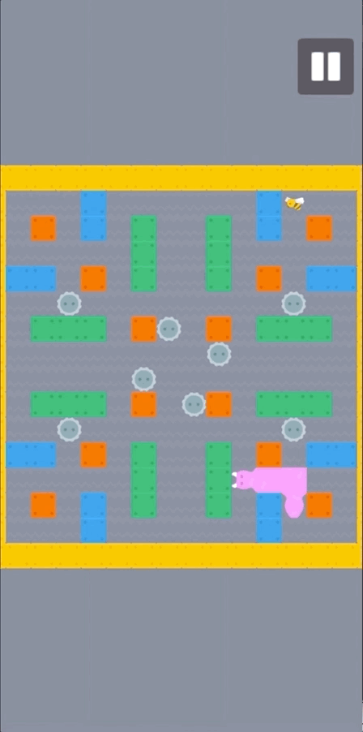
  

# 🍱 Features
- Cross-platform: `macOS` & `iOS`. `tvOS` can be easily added as an update.
- `Extendable`, `data-driven` architecture: you can easily add a new level without any programming (well, almost 😄). 
- **Six** levels: from very trivial to insane difficulty level.
- Fully native implementation: `Swift` & `SpriteKit` only. 
- `One external` dependency.

# 📝 Controls

## iOS
On `iOS` all the controls are handled by `swipe` gestures. There are **4** gestures for swipe `up`, `left`, `down` and `right`. You will get the `haptic` feedback on the supported devices for when the `direction` of the `wormy` is changed. If you double swipe to a direction, the second swipe will be ignored.

## macOS
On `macOS` all the controls are handled by `arrow` keys. There are **4** keys for turning to `up ⬆️`, `left ⬅️`, `down ⬇️` and `right ➡️` directions. If you double tap to a direction, the second one will be ignored. In order to `pause/resume` the game you need to tap on `escape` key. 

# 🔗 Dependencies
The project currently has one dependency, which is [device-kit](https://github.com/jVirus/device-kit) framework.

# 🏗 How to create a new level
There is a possibility to create new levels, almost without any programming. Let's get started:

#### 1. Create a new `.sks` file:

  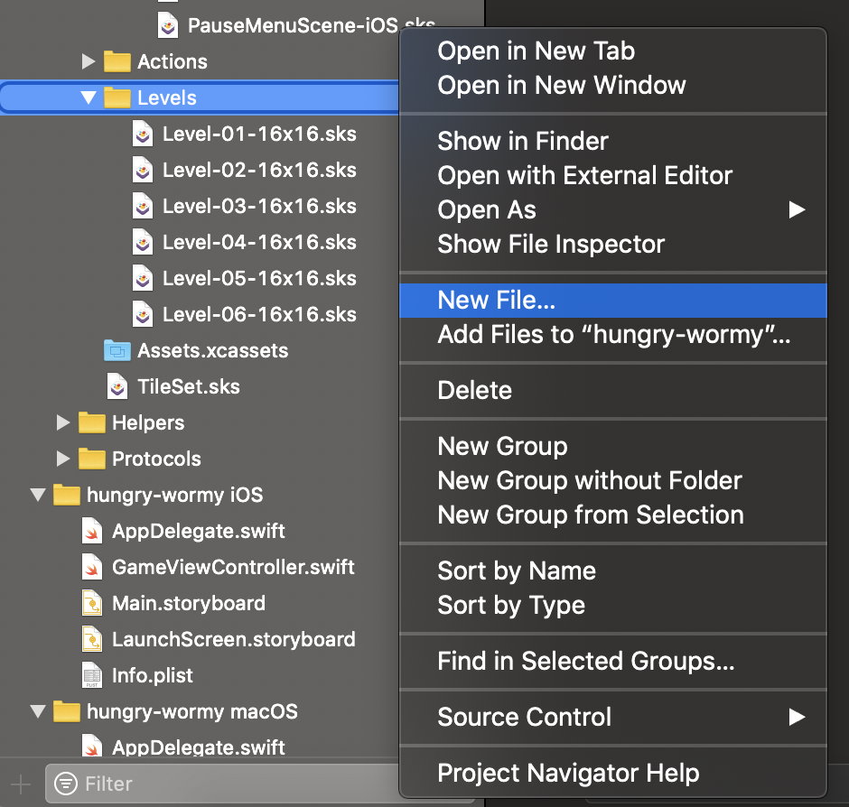
  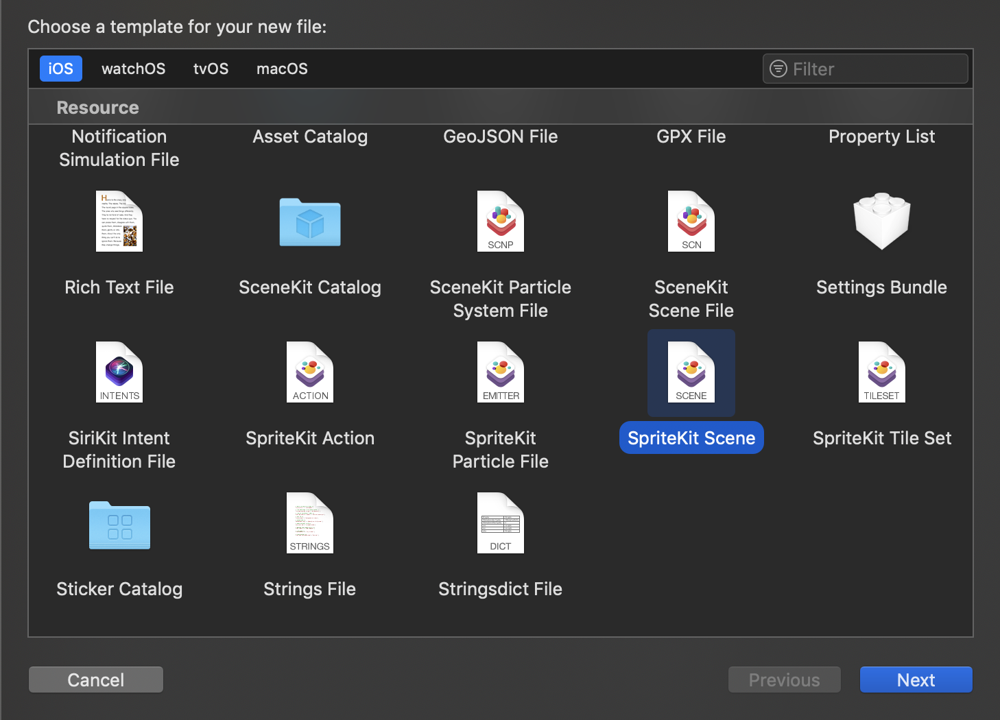

#### 2. Give it a name:

  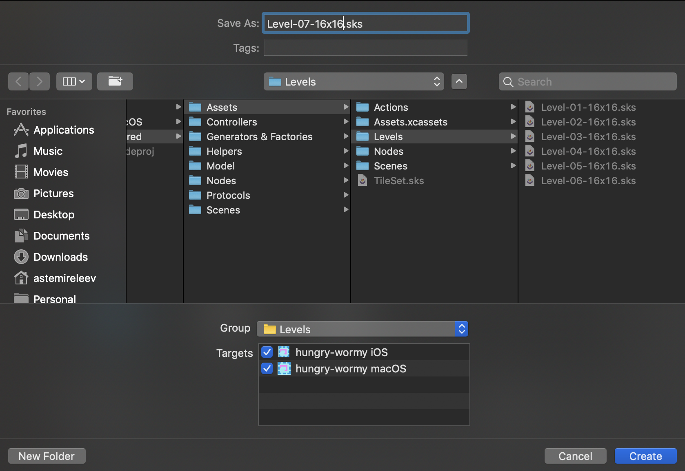

#### 3. Set the scene size to the following dimensions:

  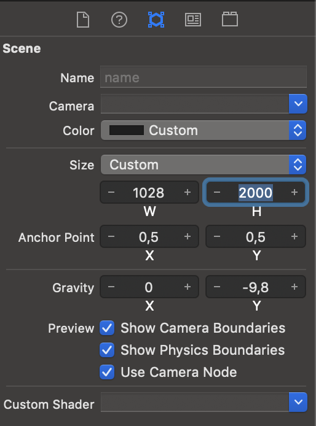

#### 4. Add **3** tile maps to the scene and set their properties as follows:

  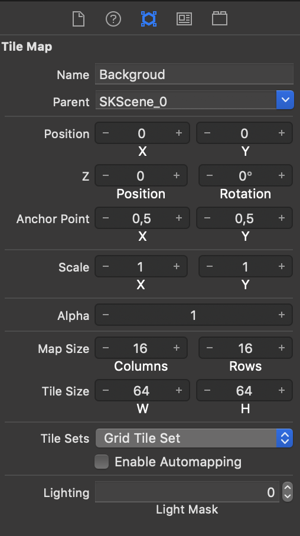
  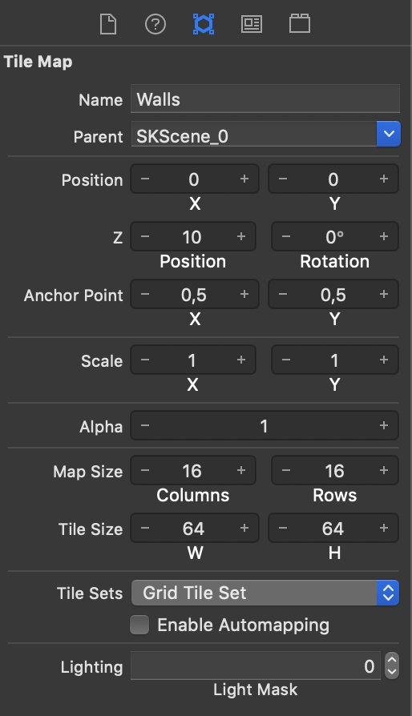
  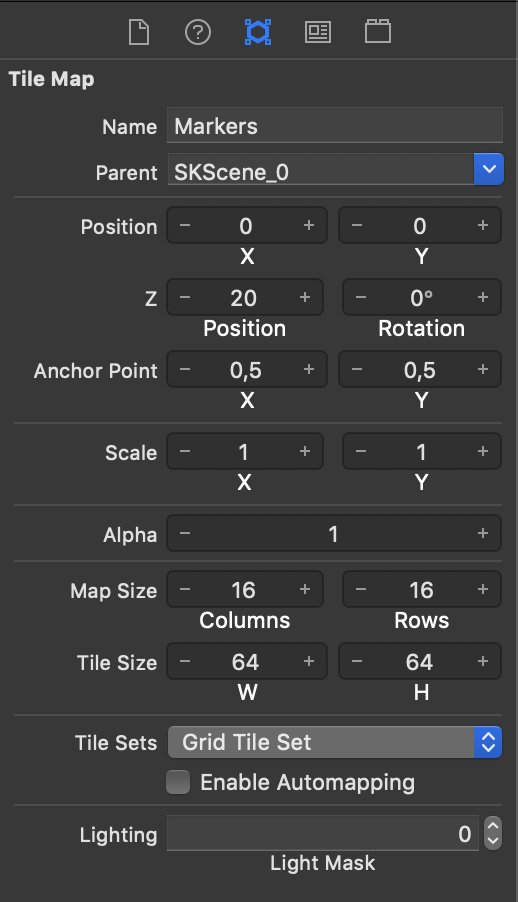

#### 5. Add a `Cover` node, copy-paste the `Pause` reference node and align everything as displayed in the following hierarchy:

  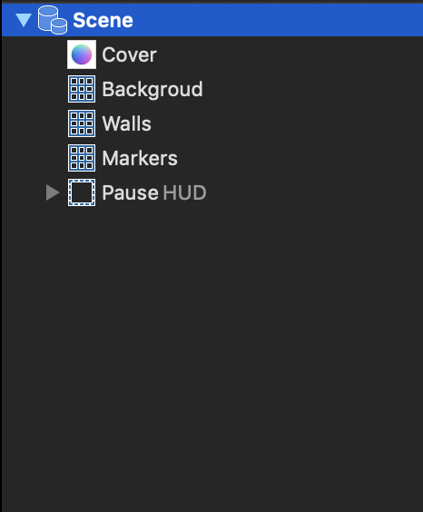

#### 7.Start editing `Background` & `Walls` tile maps by drawing tiles as you'd like:

  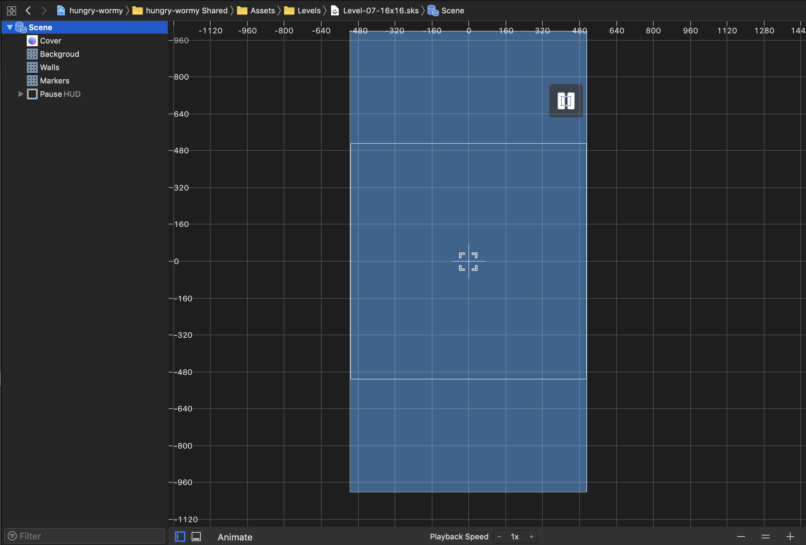
  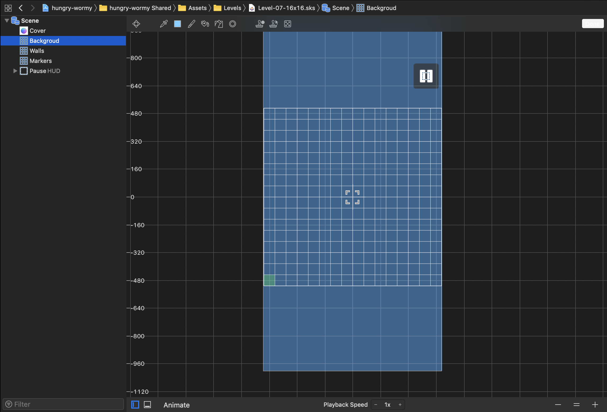

  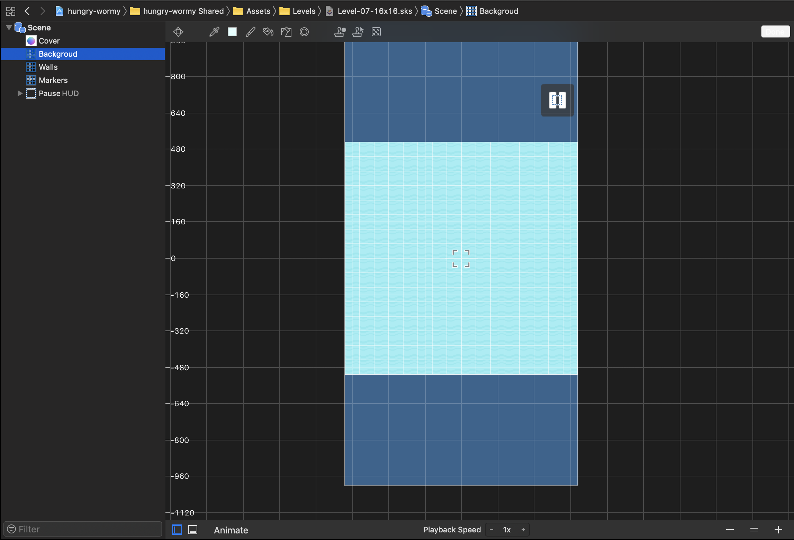
  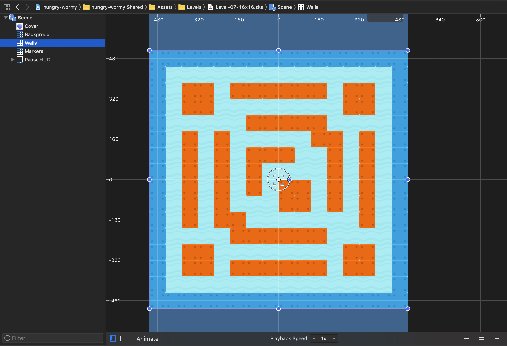

#### 8. Place the `blue` diamond tiles as `food` for `wormy` and `red` squares for spawn points:

  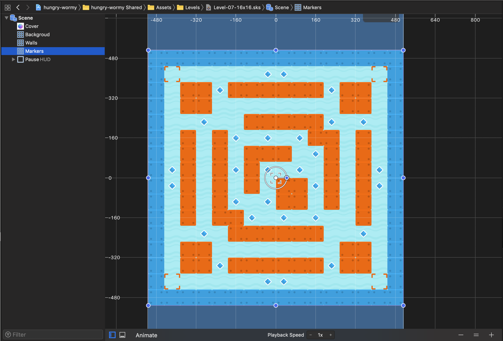

#### 9. Add new button nodes to access the level:
In `Assets/Scenes/macOS/MainMenuScene-macOS.sks` & `Assets/Scenes/iOS/MainMenuScene-iOS.sks` files with custom `User Data` key/value pair that conforms to the following scheme: `levelName`:`YourLevelName.sks`. Remember that you need to set the corresponding `target membership` options in `File Inspector` menu for each of the `.sks` files.

#### 10. Done! 
You have written zero lines of code and added a new level to the game.
 
# 🖼 Assets
The game uses assets taken from [kenney.nl](https://kenney.nl) that are published under [CC0 1.0 Universal](https://creativecommons.org/publicdomain/zero/1.0/) licence.
 
# 👨‍💻 Author 
[Astemir Eleev](https://github.com/jVirus)

# 🔖 Licence
The project is available under [MIT licence](https://github.com/jVirus/hungry-wormy/blob/master/LICENSE)

[device-kit](https://github.com/jVirus/device-kit) framework is available under [MIT licence](https://github.com/jVirus/device-kit/blob/master/LICENSE)
